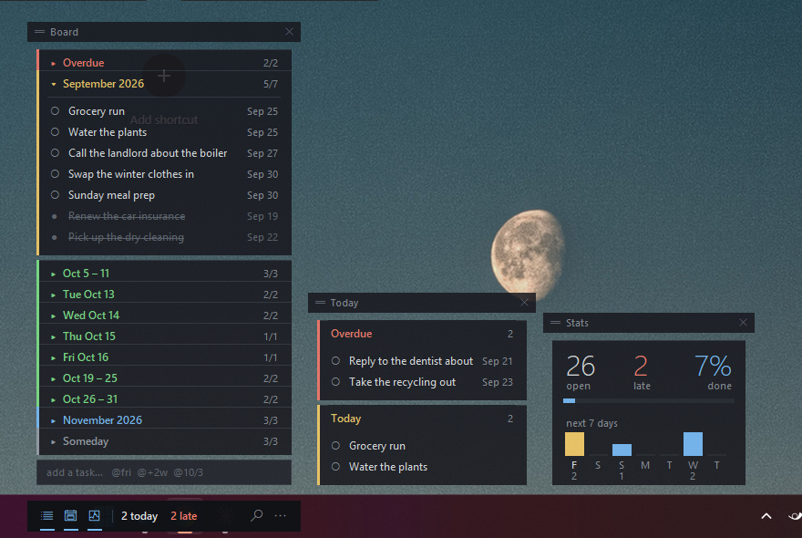

# Kanban Overlay

A see-through planning board that lives on your Windows taskbar.

It is for the case where a task list is not the thing you are doing. You are
in an IDE, a browser, a game — and you want to see what is left without
giving up a window, a taskbar slot, or a chunk of screen. Sticky Notes can
float, but it cannot tell you what is done; a kanban app can tell you, but it
wants the whole screen.

No dependencies. One file, standard-library `tkinter`, Python 3.9+.


## Download

**[Download the latest Windows release](https://github.com/sirawitbm/kanban-overlay/releases/latest)**

Download `KanbanOverlay-v0.1.0-Setup.exe` for the normal installation. It adds
Kanban Overlay to the Start menu, supports an optional desktop shortcut, and
does not require administrator access.

Windows SmartScreen may warn about the app because releases are not digitally
signed. Download only from this repository, verify the accompanying SHA-256
file, and scan the installer with Microsoft Defender. You can also build from
source if you prefer.

The portable release is named `KanbanOverlay-v0.1.0-windows-x64.zip`. Extract
the whole folder before running `KanbanOverlay.exe`; `portable.flag` tells the
app to keep its board data in that folder.

## Run from source

```
pythonw kanban_overlay.py      # no console window
python  kanban_overlay.py      # console window, for debugging
```

To try it with a populated board first:

```
python seed_demo.py
```

That writes three months of everyday-life tasks — one busy, one regular, one
quiet — shaped to exercise every branch of the bucketing rule. It refuses to
overwrite an existing board unless you pass `--force`, and keeps a `.bak`.

## The bar and its modules

**The bar** is the always-visible strip. On first run it finds your real
taskbar via `SPI_GETWORKAREA` and parks itself on it, but you can drag it
anywhere, including inside the taskbar area, and it remembers. It carries
the module buttons and two numbers —
**due today** and **overdue** — and deliberately nothing else: it shares the
taskbar, so every extra field costs length that has to come from somewhere.
Hover any button and it tells you what it opens. It stays near-solid
whatever else you set, because it is the one thing always guaranteed
clickable.

When the bar overlaps a Windows taskbar, it attaches to that taskbar's native
window automatically. This keeps it visible when Start, Search, or another
taskbar surface opens. Moving it back onto the desktop detaches it again.

There is a **tray icon** as well. Left-click brings the app back, right-click
gives a short menu, and you can quit from there. **Hide to tray** puts the
bar and every module away and leaves only the icon. Windows 11 files new
tray icons under the overflow arrow (`^`) by default — drag it out, or turn
it on under Settings → Personalization → Taskbar → Other system tray icons,
to keep it visible.



**The modules** are summoned by the buttons on the left of the bar. Each one
is its own window:

| module | what it shows |
| --- | --- |
| **Board** | the post-it stack of time buckets, plus the task input |
| **Today** | overdue, today and tomorrow — nothing else |
| **Stats** | open / late / done at a glance, and the next seven days |

A module starts **docked**: laid out in a row beside the bar, following it
wherever you drag it. Grab its header and it **detaches** — it floats where
you dropped it and stays there, independent of the bar and of every other
module. A dot beside the module's name means it is floating. Double-click
the header, or pick **Dock all modules**, to send it back to the row.

Only the bar is permanent. If you turn on **Hide when unfocused** in the bar
menu, the modules also get out of the way the moment you click back into
whatever you were doing, and clicking the bar brings them back. It is off by
default: Windows makes no promise that clicking an overlay window gives it
the foreground, and when it does not, auto-hiding pulls a module out from
under the pointer and reads as the app ignoring you.

Ghost mode is exempt from that, deliberately: reading your tasks while you
work in another window is the whole point of it, so auto-hiding there would
leave the mode with nothing to do.

Always-on-top is re-asserted on a timer rather than set once, because Tk
applies `WS_EX_TOPMOST` at window creation and never again — anything that
goes topmost afterwards otherwise ends up above the bar and stays there.
Exclusive-fullscreen games still cover everything; nothing short of an
overlay hook changes that.

## Sections are time, not stages

Most boards ask you to sort work into To Do / Doing / Done columns. This one
sorts by *when*, and re-sorts itself as the list grows:

- tasks group by month
- a month holding more than **5 open** tasks splits into weeks
- a week holding more than **5 open** tasks splits into days
- anything open and past due is pulled into a pinned **Overdue** card
- anything undated falls to **Someday** at the bottom

Completed tasks never count toward that threshold. Finishing work collapses
the board back down instead of fragmenting it further — a month with four
open and six done stays one card.

When the expanded stack is taller than the available screen space, use the
mouse wheel over a module to scroll it.

Stage lives per task instead: click the glyph to cycle ○ todo → ◐ doing →
● done.

## Ghost mode


Two display modes, F2 or the bar menu:

| mode | what it does |
| --- | --- |
| **frosted** | translucent dark cards, fully interactive — use this to plan |
| **ghost** | card backgrounds keyed out entirely, clicks fall straight through to the app behind — use this while you work |

Ghost mode is read-only by design: the clicks that pass through are the whole
point. Text gets a 1px dark halo so it stays readable over whatever is
underneath. The bar never goes ghost, so there is always a way back.

## Search


The magnifier on the bar, or `Ctrl+F`. A large input opens mid-screen and
lists live matches as you type.

- **Enter** attaches the term to the bar as a filter block with its own
  discard button. Click the `×` and the filter drops and the block detaches.
- **Clicking a result** jumps straight to the card that task lives in.

Filters stack and narrow with AND. A filter narrows the *whole board*, not
just the view — the counts, the Stats module and the splitting rule all run
on the filtered set, so filtering a split month back under the cap collapses
it into one card again.

## Adding tasks

Type in the field at the bottom of the Board module. A trailing `@` sets the date:

| you type | you get |
| --- | --- |
| `Grocery run` | Someday |
| `Dentist @fri` | next Friday |
| `Pay rent @31` | the 31st, this month or next |
| `Flights @10/3` | 3 October |
| `Renew domain @+2w` | two weeks out |
| `Standup @tomorrow` | tomorrow |

Also `today`, `mon`–`sun`, `+3d`, `+1m`, `eow`, `eom`, and `2026-10-03`.
An `@token` that parses as nothing is left in the text rather than silently
swallowed, so a typo shows up on the card instead of vanishing.

Double-click a task to edit its text and date together in the same field.

## Keys

| key | |
| --- | --- |
| `Ctrl+N` | add a task |
| `Ctrl+F` | search |
| `Ctrl+Z` | undo the last delete |
| `F2` | frosted / ghost |
| `Ctrl+Q` | quit |

Hotkeys fire only while a window of the app has focus — these are not global
hotkeys. The bar is always clickable, which is the deliberate escape hatch.

## Your data

Tasks, bar position, mode, opacity, and active filters live in one plain JSON
file. Installed releases store it at
`%LOCALAPPDATA%\KanbanOverlay\KanbanOverlay.json`; portable and source runs keep
it beside the executable or script. Source data is git-ignored so your actual
tasks never land in a commit.

Writes go to a temp file and are renamed over the real one, so a crash
mid-save cannot leave a half-written board. The previous state is retained as
`KanbanOverlay.json.bak` and loaded automatically if the primary file is
damaged. Only one app instance can run at a time, preventing two copies from
overwriting one another.

**Run at login** is in the bar menu. It drops a small `.cmd` in your Startup
folder rather than a shortcut, since shortcuts would mean a COM dependency.

## Known limitations

- **Windows only.** `-transparentcolor` (the ghost mode key) and taskbar
  docking are both Win32. Elsewhere the bar centres itself at the bottom of
  the screen and only frosted mode is offered.
- Filters are plain case-insensitive substring matches on task text. There is
  no field syntax — no `due:`, no `status:`.
- The bar and detached modules remember which monitor they were placed on.
  Use **Reset position** from the bar menu after disconnecting a monitor if a
  saved window becomes difficult to recover.
- Weeks are Monday-start and clipped to the month they split out of, so a
  week straddling a month boundary can appear as two short cards.

## Building a release

Run the tests and build the standalone executable:

```powershell
python -m unittest discover -s tests -v
.\build.ps1
```

Create the installer, portable ZIP, and SHA-256 files with Inno Setup 6
installed:

```powershell
.\release.ps1 -Version 0.1.0
```

Artifacts are written to `dist\release`. Pushing a semantic version tag such
as `v0.1.0` runs the same tests and packaging process on GitHub Actions, then
publishes the artifacts as a GitHub Release.

## Credit

The bar's form factor is borrowed from
[TBH: Task Bar Hero](https://tbhtaskbarhero.com/) — a thing docked to the
taskbar that you glance at rather than attend to.

## License

Kanban Overlay is released under the [MIT License](LICENSE).
