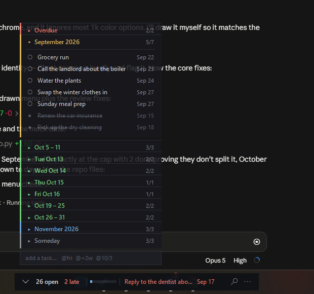
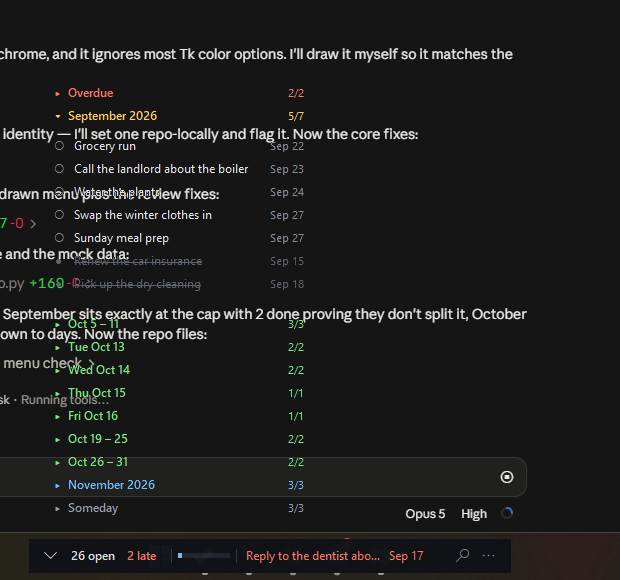
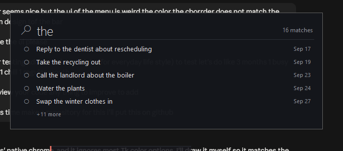

# Overlay Board

A see-through planning board that lives on your Windows taskbar.

It is for the case where a task list is not the thing you are doing. You are
in an IDE, a browser, a game — and you want to see what is left without
giving up a window, a taskbar slot, or a chunk of screen. Sticky Notes can
float, but it cannot tell you what is done; a kanban app can tell you, but it
wants the whole screen.

No dependencies. One file, standard-library `tkinter`, Python 3.8+.



## Run it

```
pythonw overlay_board.py      # no console window
python  overlay_board.py      # console window, for debugging
```

To try it with a populated board first:

```
python seed_demo.py
```

That writes three months of everyday-life tasks — one busy, one regular, one
quiet — shaped to exercise every branch of the bucketing rule. It refuses to
overwrite an existing board unless you pass `--force`, and keeps a `.bak`.

## The two pieces

**The bar** is the always-visible strip. On first run it finds your real
taskbar via `SPI_GETWORKAREA` and parks itself on it, but you can drag it
anywhere and it remembers. It shows the open count, the overdue count, a
progress meter, and the next thing due — in red if that next thing is
already late. It stays near-solid whatever else you set, because it is the
one thing always guaranteed clickable.

**The panel** is the post-it stack. It unfolds above the bar (or below, if
you drag the bar to the top half of the screen) and tucks away again.

## Sections are time, not stages

Most boards ask you to sort work into To Do / Doing / Done columns. This one
sorts by *when*, and re-sorts itself as the list grows:

- tasks group by month
- a month holding more than **5 open** tasks splits into weeks
- a week holding more than **5 open** tasks splits into days
- anything open and past due is pulled into a pinned **Overdue** card
- anything undated falls to **Someday** at the bottom

Completed tasks never count toward that threshold. Finishing work collapses
the board back down instead of fragmenting it further — a month with four
open and six done stays one card.

Stage lives per task instead: click the glyph to cycle ○ todo → ◐ doing →
● done.

## Ghost mode



Two display modes, F2 or the bar menu:

| mode | what it does |
| --- | --- |
| **frosted** | translucent dark cards, fully interactive — use this to plan |
| **ghost** | card backgrounds keyed out entirely, clicks fall straight through to the app behind — use this while you work |

Ghost mode is read-only by design: the clicks that pass through are the whole
point. Text gets a 1px dark halo so it stays readable over whatever is
underneath. The bar never goes ghost, so there is always a way back.

## Search



The magnifier on the bar, or `Ctrl+F`. A large input opens mid-screen and
lists live matches as you type.

- **Enter** attaches the term to the bar as a filter block with its own
  discard button. Click the `×` and the filter drops and the block detaches.
- **Clicking a result** jumps straight to the card that task lives in.

Filters stack and narrow with AND. A filter narrows the *whole board*, not
just the view — the counts, the meter, and the splitting rule all run on the
filtered set, so filtering a split month back under the cap collapses it into
one card again.

## Adding tasks

Type in the field at the bottom of the panel. A trailing `@` sets the date:

| you type | you get |
| --- | --- |
| `Grocery run` | Someday |
| `Dentist @fri` | next Friday |
| `Pay rent @31` | the 31st, this month or next |
| `Flights @10/3` | 3 October |
| `Renew domain @+2w` | two weeks out |
| `Standup @tomorrow` | tomorrow |

Also `today`, `mon`–`sun`, `+3d`, `+1m`, `eow`, `eom`, and `2026-10-03`.
An `@token` that parses as nothing is left in the text rather than silently
swallowed, so a typo shows up on the card instead of vanishing.

Double-click a task to edit its text and date together in the same field.

## Keys

| key | |
| --- | --- |
| `Ctrl+N` | add a task |
| `Ctrl+F` | search |
| `Ctrl+Z` | undo the last delete |
| `F2` | frosted / ghost |
| `Ctrl+Q` | quit |

Hotkeys fire only while a window of the app has focus — these are not global
hotkeys. The bar is always clickable, which is the deliberate escape hatch.

## Your data

Everything lives in `OverlayBoard.json` next to the script: tasks, bar
position, mode, opacity, active filters. Plain JSON, safe to hand-edit while
the app is closed, and git-ignored so your actual tasks never land in a
commit. Writes go to a temp file and are renamed over the real one, so a
crash mid-save cannot leave you with a half-written board.

**Run at login** is in the bar menu. It drops a small `.cmd` in your Startup
folder rather than a shortcut, since shortcuts would mean a COM dependency.

## Known limitations

- **Windows only.** `-transparentcolor` (the ghost mode key) and taskbar
  docking are both Win32. Elsewhere the bar centres itself at the bottom of
  the screen and only frosted mode is offered.
- Filters are plain case-insensitive substring matches on task text. There is
  no field syntax — no `due:`, no `status:`.
- Placement uses the primary monitor's geometry, so a bar dragged to a second
  monitor may be clamped back on the next launch.
- The panel does not scroll. A very tall stack can run off screen — collapse
  cards, filter, or clear completed.
- Weeks are Monday-start and clipped to the month they split out of, so a
  week straddling a month boundary can appear as two short cards.

## Credit

The bar's form factor is borrowed from
[TBH: Task Bar Hero](https://tbhtaskbarhero.com/) — a thing docked to the
taskbar that you glance at rather than attend to.
